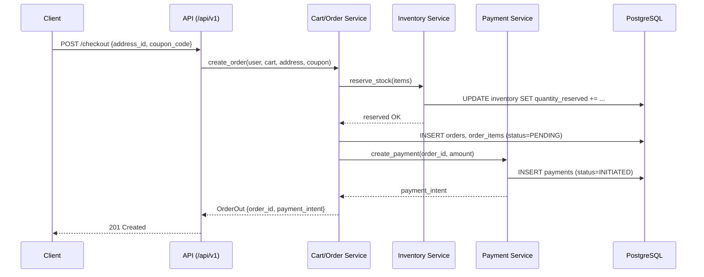

# API Design

## Conventions

- **Base path:** `/api/v1/` — all breaking changes go into a new `/api/v2/` mounted alongside, old clients unaffected.
- **Auth:** `Authorization: Bearer <access_token>` (JWT). Refresh via `POST /api/v1/auth/refresh` with the refresh token.
- **Response envelope** (`app/common/schemas/response.py`):
  ```json
  { "success": true, "data": { ... }, "meta": { "page": 1, "page_size": 20, "total": 134 } }
  ```
  ```json
  { "success": false, "error": { "code": "PRODUCT_NOT_FOUND", "message": "..." } }
  ```
- **Pagination:** `?page=1&page_size=20` query params on all list endpoints, `meta` block in response.
- **Filtering/sorting:** `?category=laptops&min_price=100&max_price=2000&sort=-created_at`
- **Docs:** auto-generated OpenAPI at `/docs` (Swagger UI) and `/redoc`, served directly by FastAPI.

## Planned Endpoint Map (implemented across Steps 3, 5, 6, 7)

### Auth — `/api/v1/auth`
| Method | Path | Access |
|---|---|---|
| POST | `/register` | Public |
| POST | `/login` | Public |
| POST | `/refresh` | Public (valid refresh token) |
| POST | `/logout` | Authenticated |
| POST | `/forgot-password` | Public |
| POST | `/reset-password` | Public (valid reset token) |
| GET | `/me` | Authenticated |

### Users — `/api/v1/users`
| Method | Path | Access |
|---|---|---|
| GET/PUT | `/me` | Authenticated |
| GET | `/` | Admin |
| PATCH | `/{id}/status` | Admin |

### Categories — `/api/v1/categories`
| Method | Path | Access |
|---|---|---|
| GET | `/` | Public |
| GET | `/{slug}` | Public |
| POST / PUT / DELETE | `/` `/{id}` | Admin |

### Products — `/api/v1/products`
| Method | Path | Access |
|---|---|---|
| GET | `/` (search/filter/paginate) | Public |
| GET | `/{slug}` | Public |
| POST / PUT / DELETE | `/` `/{id}` | Admin |
| POST | `/{id}/images` | Admin |

### Inventory — `/api/v1/inventory`
| Method | Path | Access |
|---|---|---|
| GET | `/{product_id}` | Admin |
| PATCH | `/{product_id}` | Admin |
| GET | `/low-stock` | Admin |

### Wishlist — `/api/v1/wishlist`
| Method | Path | Access |
|---|---|---|
| GET | `/` | Authenticated |
| POST / DELETE | `/{product_id}` | Authenticated |

### Cart & Checkout — `/api/v1/cart`, `/api/v1/checkout`
| Method | Path | Access |
|---|---|---|
| GET | `/cart` | Authenticated (or guest session) |
| POST / PATCH / DELETE | `/cart/items/{product_id}` | Authenticated |
| POST | `/checkout` | Authenticated |

### Orders — `/api/v1/orders`
| Method | Path | Access |
|---|---|---|
| GET | `/` | Authenticated (own orders) / Admin (all) |
| GET | `/{id}` | Authenticated (owner) / Admin |
| PATCH | `/{id}/status` | Admin |
| POST | `/{id}/cancel` | Authenticated (owner) |

### Addresses — `/api/v1/addresses`
| Method | Path | Access |
|---|---|---|
| GET / POST / PUT / DELETE | `/` `/{id}` | Authenticated |

### Reviews — `/api/v1/products/{product_id}/reviews`
| Method | Path | Access |
|---|---|---|
| GET | `/` | Public |
| POST | `/` | Authenticated |
| PUT / DELETE | `/{id}` | Authenticated (owner) |

### Coupons — `/api/v1/coupons`
| Method | Path | Access |
|---|---|---|
| POST | `/validate` | Authenticated |
| GET / POST / PUT / DELETE | `/` `/{id}` | Admin |

### Admin — `/api/v1/admin`
| Method | Path | Access |
|---|---|---|
| GET | `/dashboard` | Admin |
| GET | `/analytics/sales` | Admin |

## API Flow Diagram — Checkout (representative sequence)


