# Deployment Roadmap

This is the **future** path, executed only after the application itself is
complete (Steps 2–10). It's documented now so the folder structure
(`infra/`) already matches where each artifact will live.

```mermaid
graph LR
    A["App Complete<br/>(Steps 1-10)"] --> B["Phase 1<br/>Dockerize"]
    B --> C["Phase 2<br/>Docker Compose<br/>(local multi-container)"]
    C --> D["Phase 3<br/>CI<br/>GitHub Actions / Jenkins"]
    D --> E["Phase 4<br/>Container Registry<br/>(ECR)"]
    E --> F["Phase 5<br/>Kubernetes<br/>(EKS via Terraform)"]
    F --> G["Phase 6<br/>Helm Charts"]
    G --> H["Phase 7<br/>Ingress + Nginx"]
    H --> I["Phase 8<br/>Observability<br/>Prometheus + Grafana"]
    I --> J["Phase 9<br/>CD<br/>automated rollout"]
    J --> K["Phase 10<br/>Microservice split<br/>+ RabbitMQ"]
```

## Phase 1 — Docker

- `infra/docker/backend/Dockerfile` — multi-stage: install deps → copy app → run under Gunicorn+Uvicorn workers.
- `infra/docker/frontend/Dockerfile` — multi-stage: `npm run build` with Vite → serve static output via Nginx.
- `infra/docker/nginx/Dockerfile` + config — reverse proxy: `/api/*` → backend, `/*` → frontend static files.
- Deliverable: `docker build` succeeds for both images independently.

## Phase 2 — Docker Compose (local orchestration)

- `infra/docker-compose/docker-compose.yml` — backend, frontend, postgres, redis, nginx as one local stack.
- `infra/docker-compose/docker-compose.prod.yml` — production-shaped overrides (no bind mounts, real env files).
- Deliverable: `docker compose up` gives a fully working local environment identical in shape to production.

## Phase 3 — CI (GitHub Actions + Jenkins)

- `.github/workflows/ci.yml` — on PR: lint (ruff/eslint), test (pytest/vitest), build check.
- `.github/workflows/cd.yml` — on merge to main: build & push images to ECR, tag by git SHA.
- `infra/jenkins/Jenkinsfile` — parallel pipeline mirroring the same stages, for learning Jenkins specifically
  (declarative pipeline: Checkout → Lint → Test → Build → Push → Deploy).
- Deliverable: every PR is automatically linted/tested; every merge produces a deployable image.

## Phase 4 — Container Registry

- AWS ECR repositories per image (`ecommerce/backend`, `ecommerce/frontend`, `ecommerce/nginx`).
- Provisioned via Terraform (Phase 5 module), pushed to by CI (Phase 3).

## Phase 5 — Kubernetes (via Terraform)

- `infra/terraform/modules/` — reusable modules: VPC, EKS cluster, RDS (Postgres), ElastiCache (Redis), IAM, ECR.
- `infra/terraform/environments/{dev,staging,prod}/` — root modules composing the above per environment.
- `infra/kubernetes/base/` — Deployment, Service, ConfigMap, Secret, HPA manifests (environment-agnostic).
- `infra/kubernetes/overlays/{dev,staging,prod}/` — Kustomize overlays for replica counts, resource limits, env-specific config.
- Deliverable: `terraform apply` provisions AWS infra; `kubectl apply -k overlays/dev` deploys the app onto EKS.

## Phase 6 — Helm

- `infra/helm/ecommerce-chart/` — packages the Kubernetes manifests from Phase 5 into a parameterized chart
  (`values.yaml` per environment: image tags, replica counts, resource requests/limits, ingress host).
- Deliverable: `helm upgrade --install ecommerce ./ecommerce-chart -f values-dev.yaml` replaces raw `kubectl apply`.

## Phase 7 — Ingress + Nginx

- `infra/nginx/` — Ingress controller config / annotations: TLS termination (cert-manager + Let's Encrypt),
  path-based routing (`/api` → backend service, `/` → frontend service), rate limiting at the edge.

## Phase 8 — Observability

- `infra/monitoring/prometheus/` — scrape configs targeting each service's `/metrics` endpoint
  (FastAPI instrumented via `prometheus-fastapi-instrumentator`, added to `core/` in the app phase but activated here).
- `infra/monitoring/grafana/dashboards/` — dashboards for request rate/latency/error-rate (RED metrics),
  DB connection pool usage, order throughput (business metric).
- Alerting rules: error-rate spike, pod restarts, DB connection exhaustion.

## Phase 9 — CD (automated rollout)

- Extend `.github/workflows/cd.yml` (or Jenkins) to run `helm upgrade` against the target environment
  after image push, with a manual approval gate for `prod`.
- Rollout strategy: rolling update (K8s default) → optional blue/green or canary via Helm/Argo Rollouts as a stretch goal.

## Phase 10 — Microservice Split + RabbitMQ

- Execute the extraction order defined in `docs/MICROSERVICES_ROADMAP.md`.
- `infra/rabbitmq/` — broker config + exchange/queue definitions for `order.created`, `payment.completed`, `stock.low`.
- Each extracted service gets its own Dockerfile, Helm subchart (or chart), Terraform-provisioned database,
  and Prometheus scrape target — repeating Phases 1–8 per service, now with real practice reps.

## Explicit Non-Goals For Now

- No Dockerfiles, Compose files, K8s manifests, Helm templates, or Terraform `.tf` files are written in
  Steps 1–10. `infra/` only contains `README.md` placeholders stating intent, per the requirement to keep
  the app build and the DevOps build as clearly separated phases.
