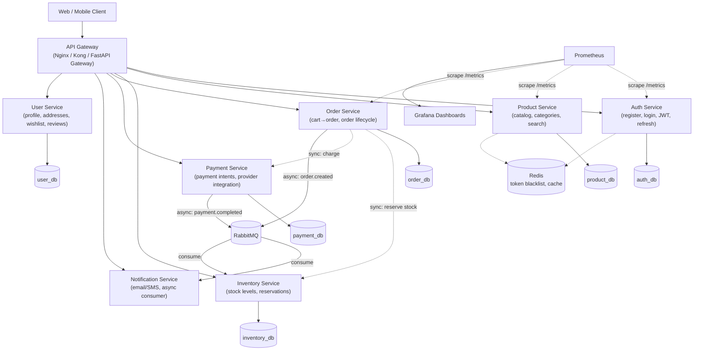

# Future Microservices Architecture

The application ships as a **modular monolith**. This document is the concrete
plan for splitting it into independent services later, once the app is
functionally complete and it's time to practice Kubernetes/Helm/Terraform.

## Target Architecture

## Module → Service Mapping

| Current module (`backend/app/modules/`) | Future service | Owns DB tables |
|---|---|---|
| `auth/` | **Auth Service** | `users` (auth fields), `refresh_tokens`, `roles` |
| `users/`, `addresses/`, `wishlist/`, `reviews/` | **User Service** | `users` (profile), `addresses`, `wishlists`, `wishlist_items`, `reviews` |
| `products/`, `categories/` | **Product Service** | `products`, `categories`, `product_images` |
| `inventory/` | **Inventory Service** | `inventory` |
| `orders/`, `coupons/` | **Order Service** | `orders`, `order_items`, `coupons` |
| `payments/` | **Payment Service** | `payments` |
| `notifications/` | **Notification Service** | none (event-driven, stateless or its own log table) |
| `admin/`, `analytics/` | **Admin/BFF layer** | none — aggregates via service-to-service calls or a read replica/warehouse |
| `api/v1/router.py` | **API Gateway** | none — routing/auth-passthrough only |

## Why Extraction Will Be Low-Friction

1. **No cross-module ORM imports.** A module's `service.py` only calls another
   module's `service.py` — never its `repository.py` or `models.py` directly.
   That call site becomes an HTTP/gRPC client call with the same method signature.
2. **Schemas already decoupled from ORM models.** Pydantic `schemas.py` in each
   module is what crosses the boundary today (router ↔ service); it's exactly
   the shape an API contract between services needs.
3. **Config already externalized.** `core/config.py` reads everything from env
   vars — each extracted service gets its own `.env`/ConfigMap with no code change.
4. **Stateless by design.** Auth is JWT (not server sessions), cache is Redis
   (not in-process), so any module can run as N replicas today, unchanged.
5. **DB access isolated per module's repository.** Splitting the database
   (one schema/DB per service) only requires updating each module's
   `db/session.py` connection string — repository/service code is untouched.

## Extraction Order (recommended)

1. **Notification Service** — first to extract: no synchronous callers, pure
   event consumer, lowest risk. Validates the RabbitMQ pattern.
2. **Payment Service** — isolated table, clear interface (`create_payment`,
   `get_status`), good candidate for its own security/compliance boundary.
   Practices Terraform (dedicated RDS + secrets) end to end.
3. **Inventory Service** — introduces the sync-call-becomes-network-call
   pattern (`OrderService` → `InventoryService.reserve_stock()`), a realistic
   distributed-transaction learning exercise (saga pattern).
4. **Auth Service** — becomes the shared identity provider; every other
   service verifies JWTs against its public key (no DB call needed).
5. **Product / Order / User Services** — remaining domain split once the
   pattern is proven, completing the target diagram above.

## Cross-Cutting Concerns After Split

| Concern | Solution |
|---|---|
| Service discovery | Kubernetes DNS (`service-name.namespace.svc.cluster.local`) |
| Sync inter-service calls | REST (simplest) or gRPC (later optimization) |
| Async events | RabbitMQ — `order.created`, `payment.completed`, `stock.low` |
| Config | Kubernetes ConfigMaps/Secrets, populated by Terraform/Helm values |
| Observability | Each service exposes `/metrics` (Prometheus) + structured logs |
| API entry point | Nginx Ingress or a thin FastAPI Gateway forwarding to services |
| Distributed auth | JWT verified locally by each service (public key), no per-request Auth Service round trip |
